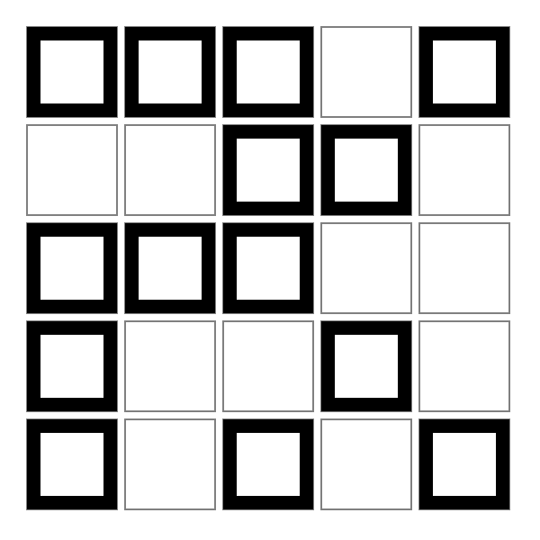
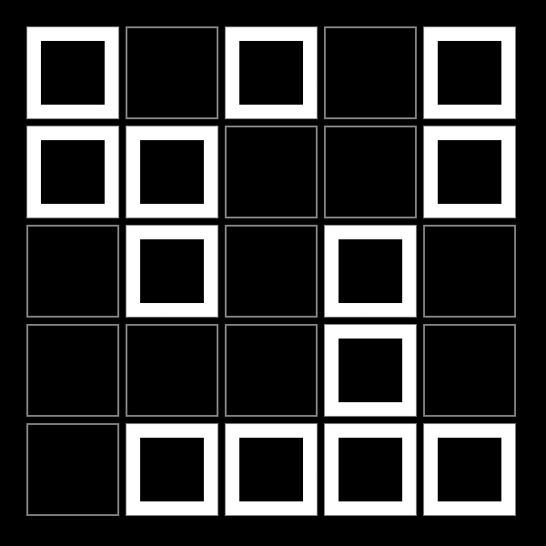
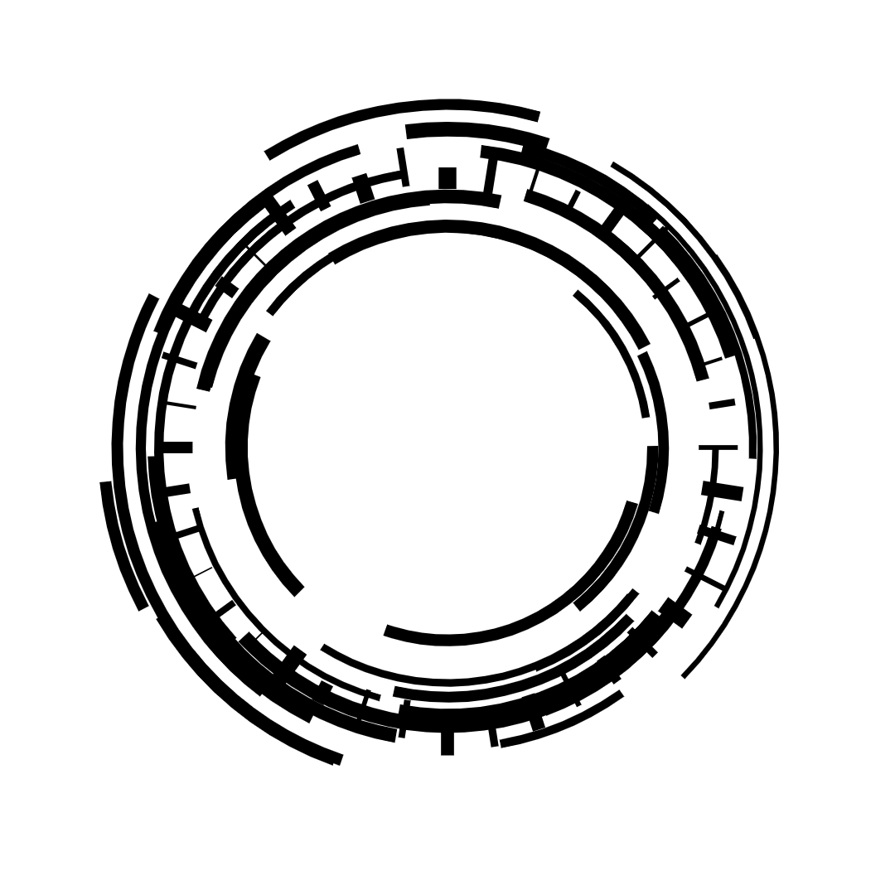
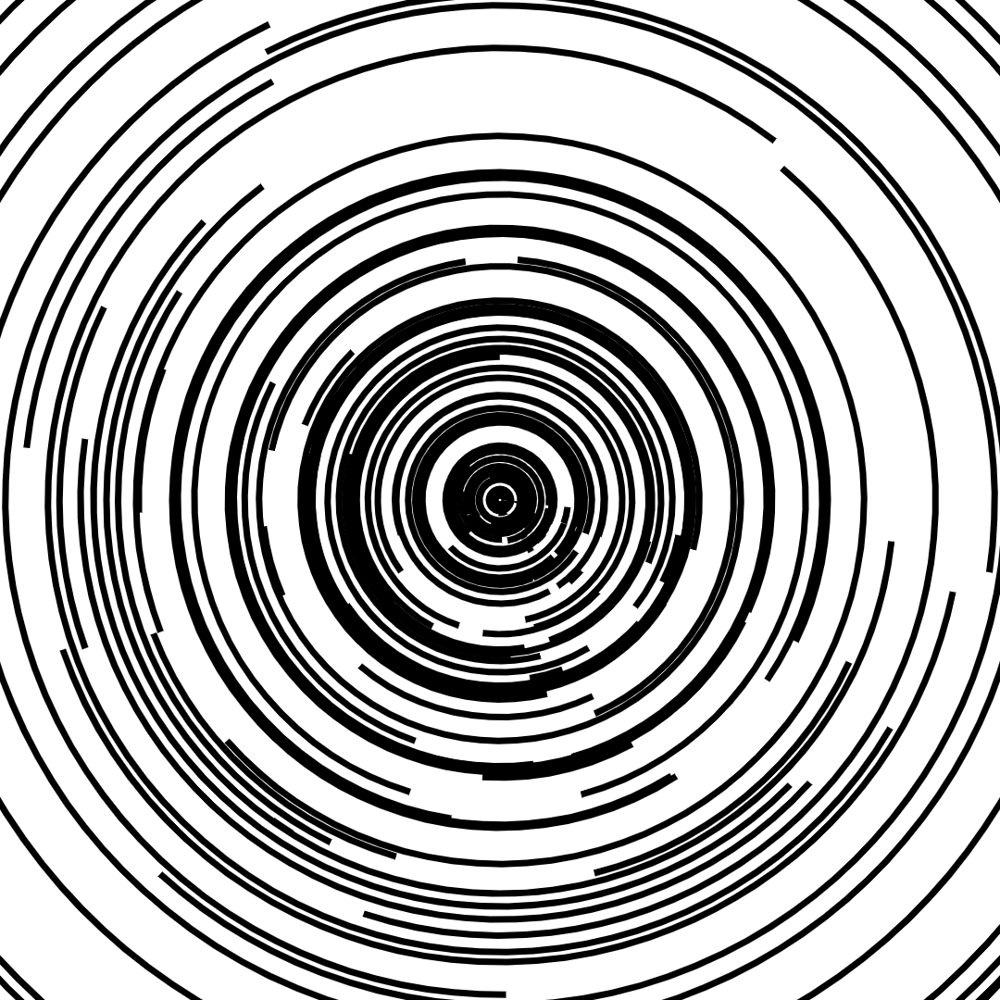
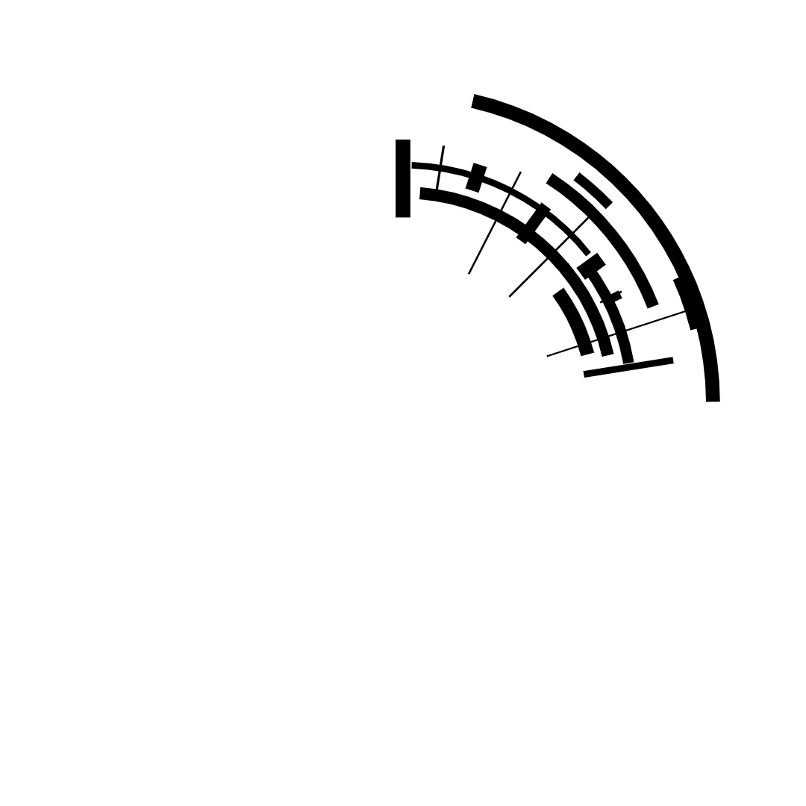
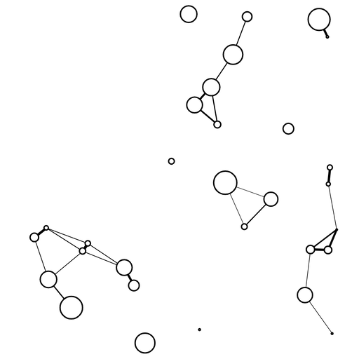

# Sketches

Exercises from this [course](https://www.domestika.org/it/courses/2729-coding-creativo-realizza-visual-con-javascript/course), using [canvas-sketch](https://github.com/mattdesl/canvas-sketch) to manipolate [the canvas webAPI](https://developer.mozilla.org/en-US/docs/Web/API/Canvas_API)

[Canvas reference](https://www.w3schools.com/tags/ref_canvas.asp)

Install canvas sketch:

```
npm install canvas-sketch-cli -g
```

Create a new sketch

```
canvas-sketch sketch.js --new --open
```

Set a screenshot folder

```
canvas-sketch sketch-02 --output=output/02
```

## Schetch 01



Canvas and js basic concepts


### sketch-01-es2



`npx canvas-sketch-cli sketch-01-es2.js`

## Schetch 02



translate

`context.translate(x, y);`
`context.rotate(0.3);`
`context.save();`
`context.restore();`

ratation, degrees and radiants
scale
[canvas-sketch-util](https://github.com/mattdesl/canvas-sketch-util)

https://ramesaliyev.com/trigonoparty/
https://www.mathsisfun.com/geometry/radians.html




## Schetch 03

Objects, classes and animations



https://github.com/mattdesl/canvas-sketch/blob/master/docs/exporting-artwork.md#ffmpeg-streaming

```
npm install @ffmpeg-installer/ffmpeg --global
```

```
# Save animations to MP4 file
canvas-sketch sketch-03 --output=output/03 --stream

# Save animations to GIF file instead
canvas-sketch sketch-03 --output=output/03 --stream=gif

# Save animations to GIF but scale it down to 512 px wide
canvas-sketch sketch-03 --output=output/03 --stream [ gif --scale=512:-1 ]
```

ctrl + shift + s
